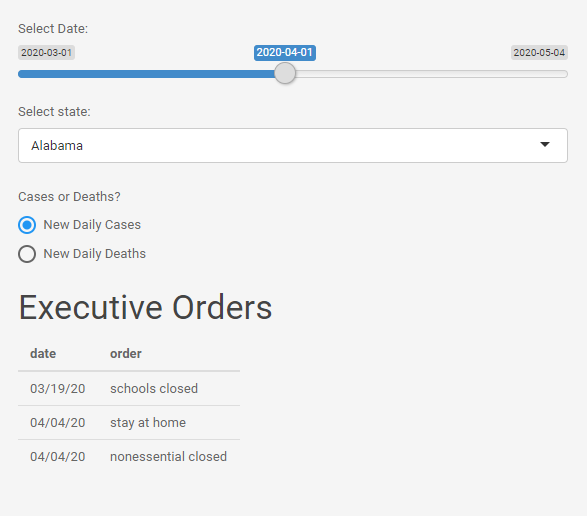
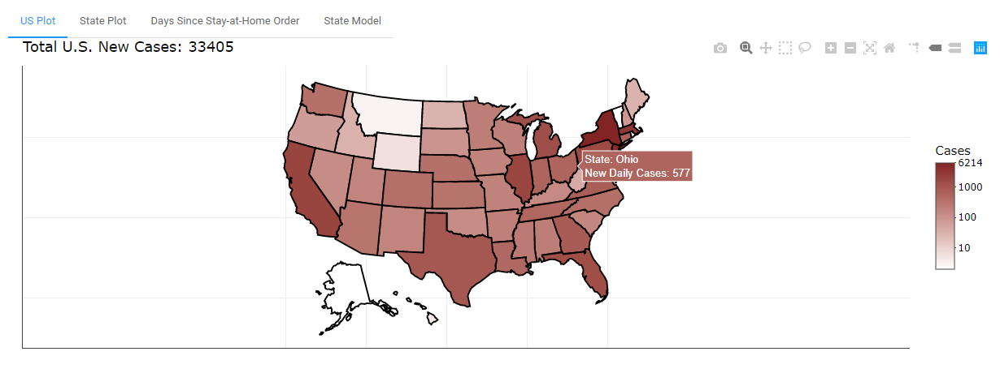
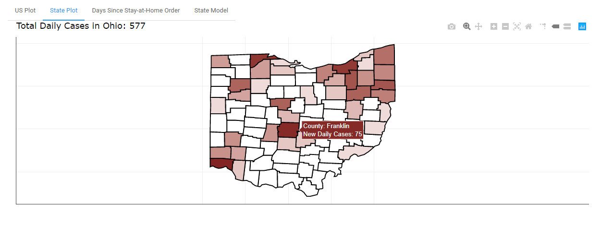
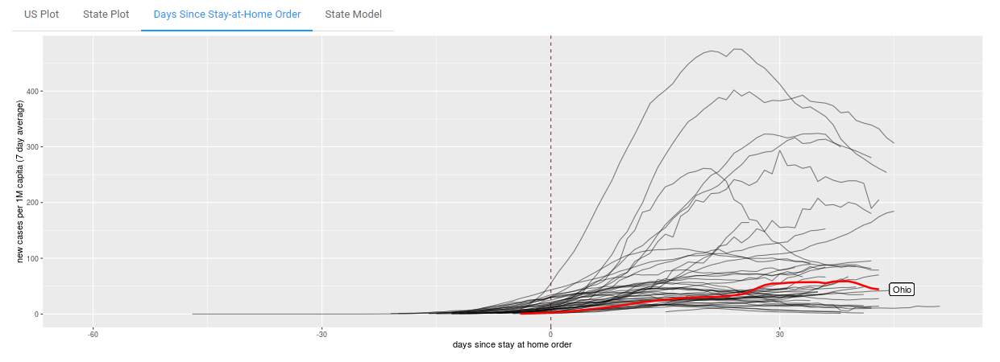

As part of a course project, I used Shiny to make an [**interactive, comprehensive COVID-19 dashboard**](https://rflynn.shinyapps.io/covid-19/) that allowed the user to clearly see metrics regarding the spread of the novel coronavirus. The web app is comprised of 4 separate parts, each of which I will go into detail on: a country-level plot, a state-level plot, a plot showing progression since stay-at-home orders were enacted by each state, and an ordinary differential equations (ODE) model that predicts the state-level progression of the virus from now (May 1st) until 50 days from now.  

### Inputs

One of the main features I wanted to implement in this dashboard was interactivity. I wanted the user to be able to see the progression of the virus on as many different levels as possible, while still maintaining clean, concise visualization that did not overshadow the actual metrics being demonstrated. To do this, the web app first allows the user to select a date on a slider, starting from March 1st. Next, the user can select a specific state to be shown in the tabs that are on the state level. Lastly, the user is able to select whether they want to view the plots in terms of new daily cases, or new daily deaths. Additionally, when a state is selected, any executive orders from that state are shown below the inputs, with the dates in which they were established.  

### US Plot  

The default tab shows a choropleth of the United States where the states that have the highest numbers of new daily cases or deaths are shown in a deep red, whereas the states with the lowest numbers are represented in white. Additional user functionality is added by making the choropleth be interactive, where hovering the cursor over a specific state allows the user to see the exact number of new daily cases or deaths for that state. The total number of new cases or deaths is also shown in the top left corner of the plot.  

### State Plot

The next tab, State Plot, allows the user to see a similar choropleth, this time of the state that they have chosen at the county level. The functionality and appearance of this tab is identical to the US plot, but serves as a way of seeing a more in-depth breakdown at what is shown in the first plot.

### Days Since Stay-at-Home Order

The next plot is a visual extension of the "Executive Orders" spot on the inputs tab, as it allows the user to see the progression of the disease relative to when a state passed a stay-at-home order. The state selected by the user is highlighted in red to more easily visualize that state in contrast to the other states. Additionally, "Day 0" on the plot is adjusted for if/when that state passed a stay-at-home order, which is why some states' lines extend further than others. The user is also able to view this graph in terms of a 7-day average of new daily cases or new daily deaths, and these numbers are adjusted per 1 million capita.  

### State Model

Lastly, the State Model tab shows a projection of how the next 50 days (from May 1st) will look in a state based on the state-specific parameters. The model uses a set of parameters estimated using ordinary differential equations (ODE). ODE based models have often been used for [epidemiological estimation](https://en.wikipedia.org/wiki/Compartmental_models_in_epidemiology) or even to evaluate [changes in species concentration](https://www.sciencedirect.com/science/article/pii/B9780128036976000059). This specific model was developed by Romik Ghosh.  

**The web app can be viewed: [here](https://rflynn.shinyapps.io/covid-19/)**

### NOTE:
The package used for this model was created for academic purposes, and has not been updated by the creator since May 4. All COVID-19 data beyond May 4 is not viewable in the web app.