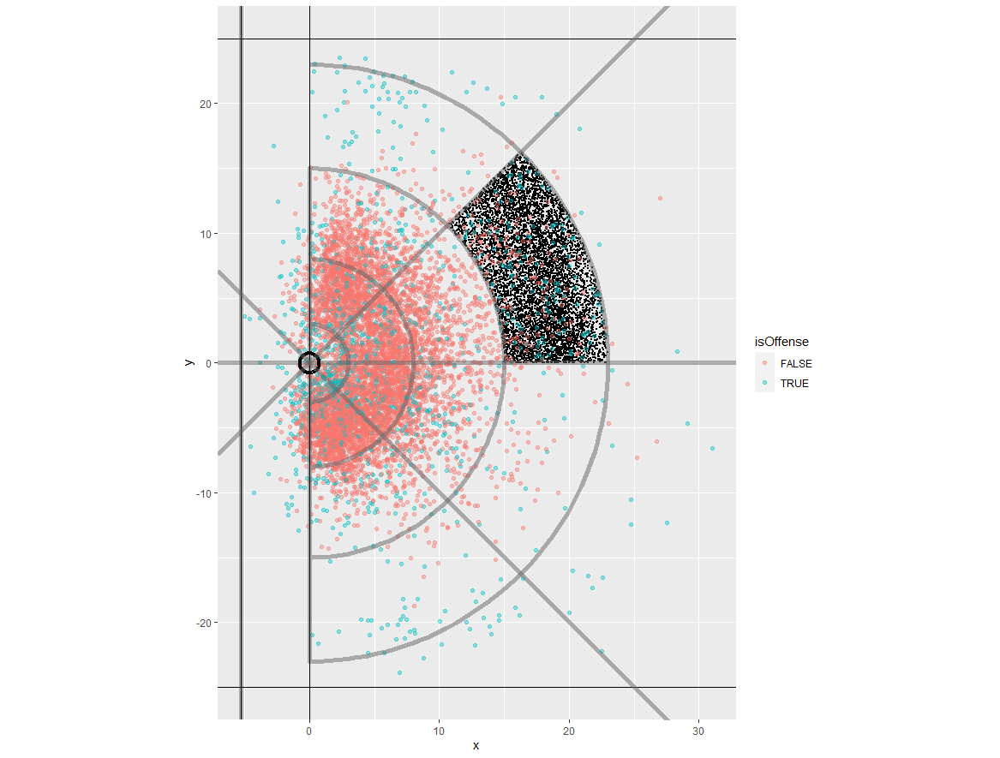
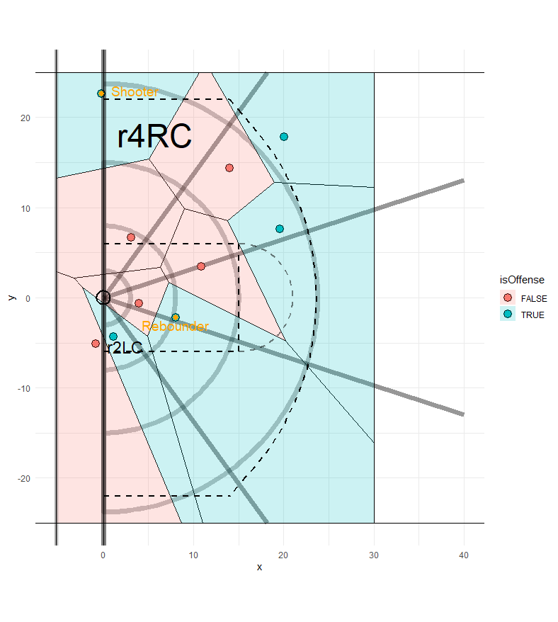

### Introduction:  

Recently, I was lucky enough to work on a project given by the Oklahoma City Thunder as part of the hiring process for an analyst internship. I unfortunately did not get the position, but learned a lot, and would like to share my experience of the model I built.  

### Objective  

The objective of the project was to build a model, using artificial NBA player tracking data, that predicts the probability of an offensive rebound given the positions of the players on the court at two different time points on a given play: when the ball was shot, and when the ball hit the rim.  

### Approach and Execution  

The beginning of any project of this magnitude is to clean the data one is working with to ensure any errors and oddities are handled and to keep things organized. Using R, I decided to join together the play-by-play data with the location data and immediately filter out any made shots. Since the objective is to estimate probabilities of an offensive rebound, my model was trained based only on missed shots, in which a rebound occurred. Additionally, to deal with easier data manipulation, I shifted the points so that the rim, originally at (-41.75, 0), was at the origin (0,0). The big picture that I wanted to keep in mind throughout the project was that if I could predict where the ball was going to go based on where it was shot from, it would be much easier to predict who it was going to be rebounded by. In order to do this, I decided to divide the court into “zones” so I could analyze where the shooter was when the ball was shot, and where the rebounder was when the ball hit the rim. After a lot of thought on how to shape and size these zones, I decided to create the zones based on a polar coordinate system, so that they would be “wedge”-shaped, and equidistant from the rim from the left side of the court to the right side. The size of these zones was also important - I wanted to keep the zones small enough to get accurate, meaningful data on where the ball was most likely to go, but large enough that it was easily digestible and useful to a front office, coaching staff, or the players. It’s possible that more accurate, narrower estimates for ball locations could have been developed, but in my opinion, it was important to keep the zones large enough to strike a balance between precision and application. By making these zones using polar coordinates, I could plot each of the player coordinates and classify them into the zones they were located in.  

After the zones were created, I evaluated where rebounders were located at each different shot location. For example, in Figure 1 shown below, the black dots represent each time the ball was shot from the right wing (between 15 and 23.75 feet from the rim), and the red and blue dots represent where those shots were estimated. By doing this for each zone, I can generate rough estimates of probabilities of where an individual ball will land given that it was shot from a specific zone.

From here, I used a spatial analysis of Voronoi tessellations (Figure 2) to develop space “ownership” for each player around the court. In this figure, we can see the offensive players (blue) and defensive players (red) and their respective Voronoi tesselations. Each of these points represent the location of these players at the time the ball hit the rim, except for the shooter, whose location is the location at which he shot the ball. The polygons shown are the Voronoi tesselations, and represent the spatial ownership of each player. Each player owns 50% of the space between him and the other players around him, creating a boundary that represents the total space that we can realistically claim as their "own." This decision of representing spatial ownership in this manner was under the assumption that since these are the "limits" to where the player can realistically get the ball, if the ball lands in a player's Voronoi tesselation, they will be the one who rebounds it. This helped refine what before were probabilities that a ball landed in a specific zone into probabilities of a specific player getting the rebound. I then simply added the probabilities of each offensive player getting the rebound to develop a baseline cumulative offensive rebound probability. Using the play in Figure 2 as an example, the model projected that the offense had a 44.3% chance of securing a rebound, which is quite a bit higher than the average probability of an offensive rebound on any given play (~24%), This is likely due to the fact that since the shot was taken from the right corner, there is an increased likelihood that it lands on the left side of the court, and the offfense has the majority of the left side of the court "owned." Additionally, shots from further out have an increased likelihood of resulting in a longer rebound, which would also mostly benefit the offense.  

  

So where exactly does this 44.3% prediction come from? Based on the data collected from the shots taken from this specific zone, which I coded as r4RC (ring 4, right corner, where ring 4 includes anything from 15 to 23.75 feet from the hoop), the most likely zone for the ball to land is r2LC (ring 2, left corner, where ring 2 includes anything from 3 to 8 feet from the hoop), where 26.7% of the shots landed. It can be seen from the Voronoi tessellations that the offensive player controls the majority of zone r2LC. Using [**Gauss’ formula**](https://en.wikipedia.org/wiki/Shoelace_formula) for finding the area of irregular polygons, I found the area of each zone that is controlled by the players who make up that zone. In this example, the offensive player has control of 84.5% of zone r2LC, and 84.5% of 26.7% is awarded to that player. In other words, given the ball lands in zone r2LC (it has a 26.7% chance of doing so) then that offensive player has an 84.5% chance of securing the rebound. This is done for each player, in each zone, and all of their individual probabilities are added to formulate a single probability of an offensive rebound. Lastly, it’s important to note that this play originally had a 45.5% chance of being rebounded by the offense, but after adjusting for the rebounding ability of the players on the floor (where the defense had a slight advantage), it was bumped down to 44.3%.

### Final Adjustments

Lastly, I wanted to incorporate player skill, but I wanted to be careful in doing so: Based on some exploratory data analysis along with my own basketball intuition, I believe that the likelihood of securing an offensive rebound is primarily based on the location of the player (and the location of the other players). However, it is important to inform these baseline predictions with the additional data we have about the particular players on the floor. To do this, I used the total “offensive rebounding rate” (offensive rebounds divided by offensive rebound chances) of each of the offensive players, and total defensive rebounding rate of the defensive players. I then developed Z-scores based on the mean and standard deviation of the rebounding rates of a lineup to establish if the offensive or defensive team had an “advantage” given how they fare compared to an average offensive or defensive lineup. I used an exponential formula to create a small, but meaningful bump or detriment to each team’s probability of offensive rebounding to give a final estimate of a team’s probability of securing an offensive rebound on a given play. If we return to the play from Figure 2, we can see that this play originally had a 45.5% chance of being rebounded by the offense, but after adjusting for the rebounding ability of the players on the floor (where the defense had a slight advantage), it was bumped down to 44.3%.  

